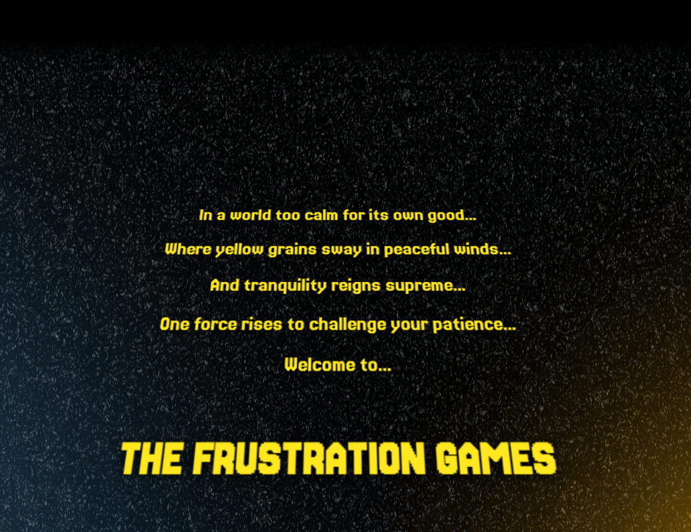
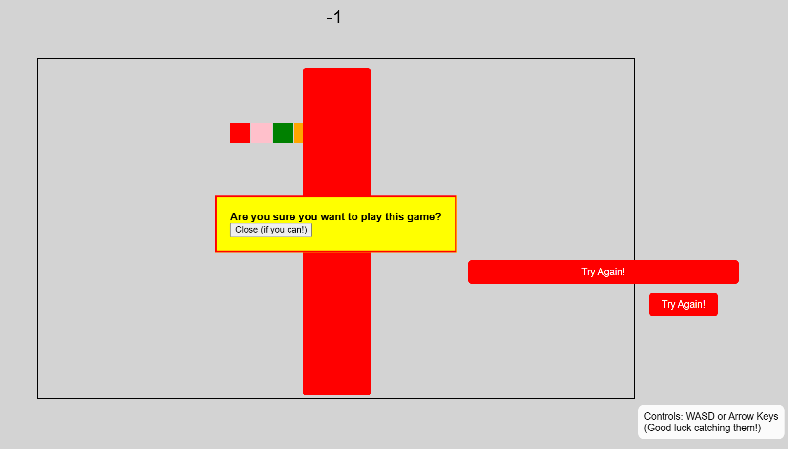
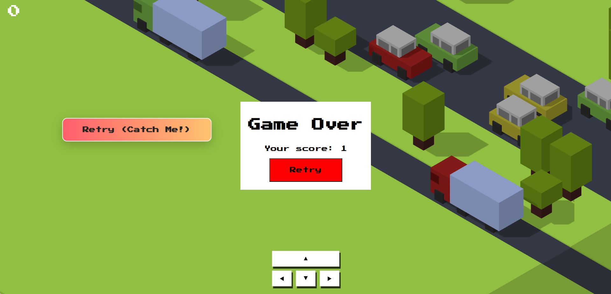
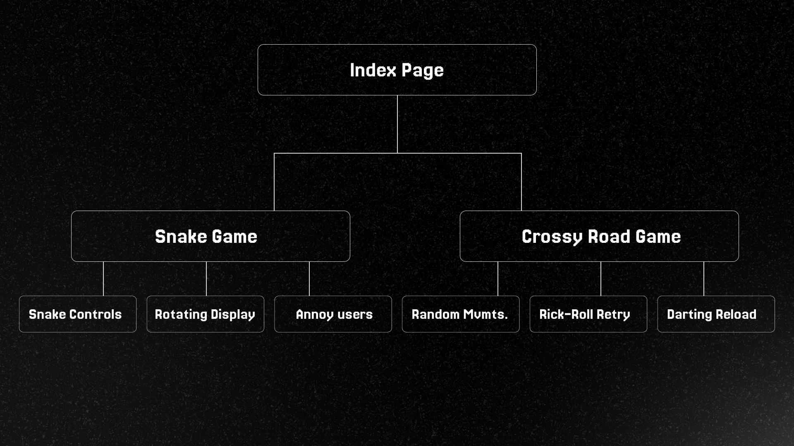

# The Frustration Games🎯

## Basic Details
### Team Name:
Icarus

### Team Members
- Team Lead: Mareo Manoj - CET

### Project Description
Simply put, this website provides two everyday games... Snake and Crossy Road, but they are tweaked in such a way that the average player might or mightn't burst out in anger.

### The Problem (that doesn't exist)
A lack of frustration amongst today's generation. Everyone is either too chill or too woke, it's time to change that.

### The Solution (that nobody asked for)
Snake and Crossy Road, the eternal stress relief games, turned into the most frustrating games you'll ever play.
## Technical Details
### Technologies/Components Used
For Software:
- Languages: HTML, CSS, JS
- Frameworks: None
- Libraries: three.js(for Crossy Road)
- Tools: Cursor, Figma

### Implementation
For Software:
# Installation
No installation required! Simply open the HTML files in any modern web browser.

## Key Features Implemented:
### Snake Game Frustrations:
- **Random Color Changes**: Snake segments change colors randomly
- **Reversed Controls**: Controls randomly reverse without warning
- **Fake Game Overs**: Shows fake "Game Over" screens that disappear
- **Moving Retry Buttons**: Buttons that flee when you try to click them
- **Disappearing Food**: Food items that vanish just as you're about to eat them
- **Negative Scoring**: Sometimes eating food decreases your score
- **Annoying Popups**: Random alerts and messages
- **Unresponsive Keys**: 10% chance keys won't work when pressed

### Crossy Road Frustrations:
- **Random Auto-Movement**: Character moves on its own randomly
- **Darting Retry Button**: The retry button moves around the screen
- **Stage Rotation**: Game board randomly rotates
- **Reload Prevention**: Can't reload the page - redirects to main menu
- **False Progress**: Score tracking that teases players

### Anti-Frustration Measures:
- **Reload Detection**: Prevents Ctrl+R, F5, and browser reload button
- **Persistent Annoyance**: Games remember your suffering
- **No Escape**: Multiple layers of frustration prevention

# Run
[Frustration Games](https://frustrationgames.netlify.app)

### Project Documentation
For Software:

#### Overview
The Frustration Games is a tiny web bundle with two deliberately annoying mini‑games — Snake and Crossy Road — presented from a single landing page. Everything runs client‑side with no build step or backend.

#### Requirements
- Modern browser (Chrome/Edge/Firefox/Safari)
- Internet access for CDN assets (Google Fonts and three.js)

#### Repository structure
- `index.html`: Landing page with a Star‑Wars style crawl and links to games
- `style.css`: Styles used by the landing page
- `snake-game/snake-game.html`: Self‑contained Snake implementation (HTML/CSS/JS inline)
- `crossyroad/crossyroad.html`: Self‑contained Crossy Road clone using three.js (HTML/CSS/JS inline)
- `images/`: Screenshots and diagram assets referenced by the README

#### How to run locally
1) Open `index.html` directly in a browser.
2) From the landing page, choose Snake or Crossy Road.
   - You can also open `snake-game/snake-game.html` or `crossyroad/crossyroad.html` directly.

#### Controls
- Snake: Arrow keys or WASD
- Crossy Road: Arrow keys or on‑screen buttons (mobile‑friendly)

#### Architecture at a glance
- Static site: no bundler, no framework, no server code
- Each game is fully isolated in its own HTML file with inline scripts and styles
- Landing page provides navigation only; it does not preload game logic
- External dependencies are loaded via CDN:
  - three.js ESM in `crossyroad/crossyroad.html`
  - Google Fonts in `index.html`

#### Game details — Snake ("The Most Annoying Snake Game Ever")
- Custom lightweight engine in a single file, organized into modules/namespaces:
  - Core utilities: `g.Time`, `g.Group`, `g.Grid`, state management helpers
  - Rendering: DOM‑driven tiles in a positioned `.stage` container
  - Entities: `BoardTile`, `SnakeTile`, `FoodTile`, `Snake`, `Food`
  - State: `StatePlay` handles lifecycle, input, layout, and the main loop
- Mechanics and annoyances implemented in code:
  - Random color segments for the snake
  - Reversed controls toggled occasionally
  - 10% chance of ignored key presses
  - Fake game‑over overlay that dismisses itself
  - Moving "retry" buttons that dodge the cursor and may redirect
  - Disappearing/reappearing food with periodic relocation
  - Negative or unpredictable scoring on eat
  - Stage shake/temporary rotation, random popups/alerts
  - Wrap‑around at edges; self‑collision triggers annoyance instead of reset
- Loop: `requestAnimationFrame` drives `StatePlay.step()` which updates/render tiles, snake, food, and timers.

#### Game details — Crossy Road (three.js)
- Rendered with three.js via ESM import; orthographic camera and basic lighting
- Procedural map generation via row metadata:
  - Rows can be `forest`, `car`, or `truck`; each stores tree/vehicle layout and direction/speed
  - New rows are appended as you progress; old rows remain in scene graph
- Player movement queue with validity checks:
  - `queueMove()` + `endsUpInValidPosition()` prevent moving off grid or into trees
  - Smooth stepping animation and rotation per move
- Vehicles move continuously across lanes and wrap when leaving bounds
- Collision detection: three.js `Box3` intersection between player and vehicles
- Annoyances implemented:
  - Random auto‑movement at irregular intervals
  - Result overlay with a separate "Retry (Catch Me!)" button that darts around the screen
  - Score equals current row progressed

#### Styling
- `style.css` styles the landing page (background, typography, crawl animation)
- Each game includes its own minimal inline styles to keep files self‑contained

#### Extending the games
- Snake:
  - Add new annoyances in `Snake.update()` or `StatePlay.step()`
  - New visual effects can be applied by toggling classes on `.stage` or tile elements
- Crossy Road:
  - Add new row types by extending the row generator and renderer
  - Inject new annoyances in `triggerRandomMovement()` or around the result overlay logic

#### Deployment
- Static hosting (e.g., GitHub Pages/Netlify). No build pipeline needed.
- Ensure external CDNs are reachable; otherwise vendor three.js locally.

#### Known limitations / notes
- Mobile: Both games are playable, but UI/controls aren’t fully optimized for small screens
- No persistence: Scores/state are not saved between sessions
- External CDNs: Offline use may fail to load fonts or three.js
- Security: Intentional use of popups/alerts; consider user experience when embedding elsewhere
- Accessibility: Animations and motion may be disruptive; no reduced‑motion handling yet

# Screenshots (Add at least 3)

*The main landing page featuring a Star Wars-style intro that welcomes players to "The Frustration Games" with links to Snake and Crossy Road games*

*The Snake game in action showing multiple frustrating elements: fake retry buttons that move when you hover over them, annoying popups, reversed controls, and a negative score of -1*

*The Crossy Road game over screen featuring the infamous "Retry (Catch Me!)" button that darts around the screen, making it nearly impossible to click*

# Diagrams

*Simple architecture showing the main index page connecting to two standalone games (Snake and Crossy Road), each with their own frustrating mechanics and anti-reload systems*

### Project Demo
# Video
[Demo Video](https://drive.google.com/file/d/131kS71voAZFe-G6dSxf8T03AIwzjWRFg/view?usp=sharing)
*A comprehensive demonstration of both games showcasing all the frustrating features: moving buttons, fake game overs, reversed controls, disappearing food, random movements, annoying popups, and the infamous darting retry button*

# Additional Demos
- [Live Demo](https://frustrationgames.netlify.app) - Experience the frustration yourself!
- See how long you can last before giving up in frustration

---
Made with ❤️ at TinkerHub Useless Projects 

